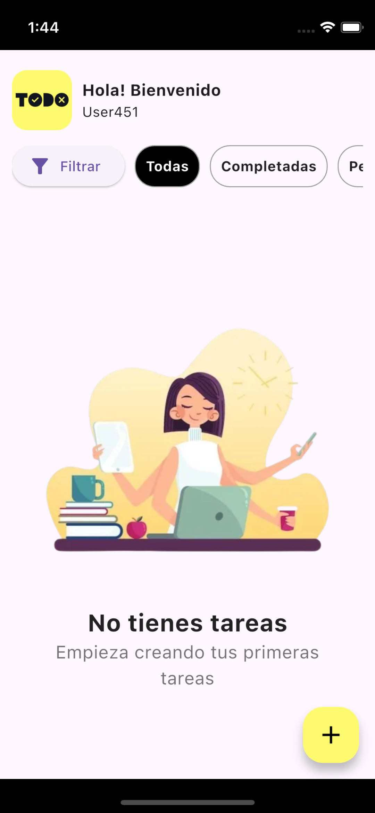
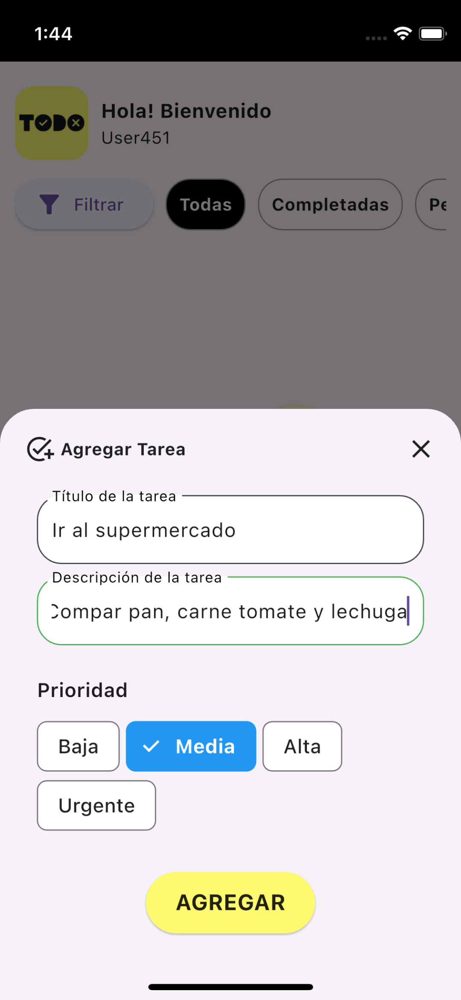
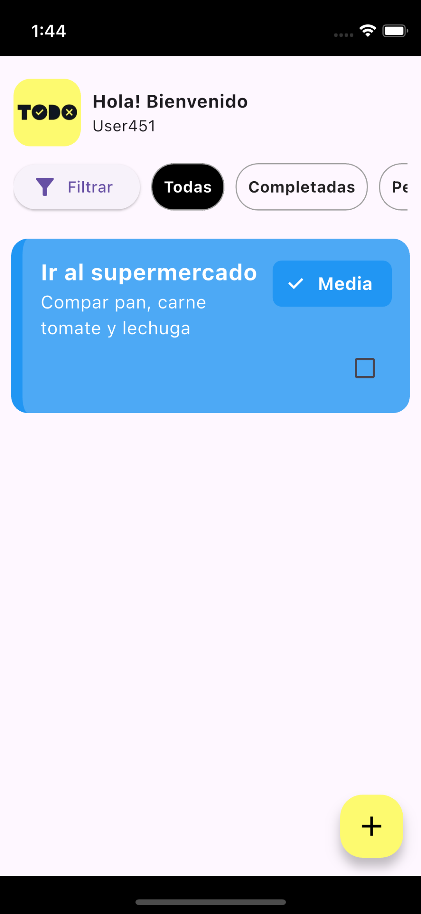
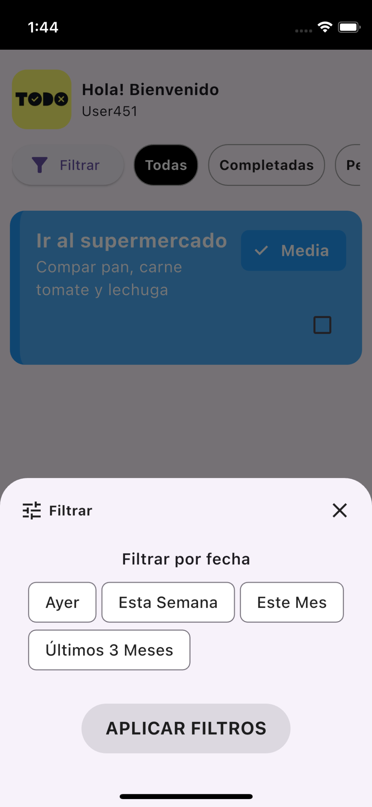

# Toap

Toap es una aplicación Flutter diseñada para ayudarte a gestionar tus tareas diarias de manera eficiente. Con una interfaz intuitiva y fácil de usar, Toap te permite organizar tus tareas, establecer prioridades y mantenerte al día con tus responsabilidades.

## Características

- Añadir, editar y eliminar tareas.
- Interfaz de usuario amigable .

## Capturas de Pantalla






## Requisitos

- Flutter SDK
- Xcode para desarrollo en iOS

## Instalación

1. Clona el repositorio del proyecto:
   ```bash
   git clone git@github.com:gega19/toap.git
   ```
